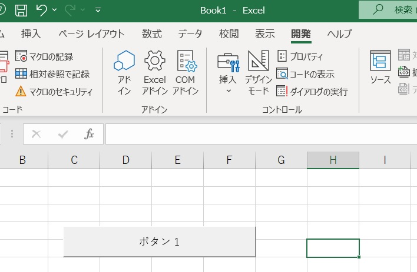
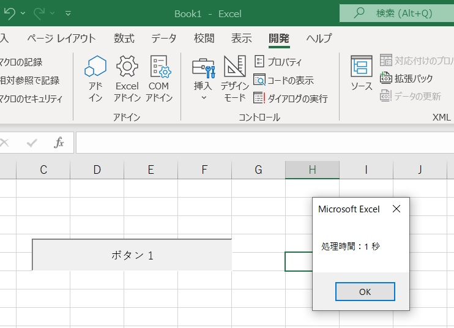

# Spread-Sprite-Spring

##### This repogitory has memorandum of codes for Excel and Spreadsheet

- - -

### Extension of each Service

##### - &nbsp; '.vba' : for Visual Basic for Application on Excel

##### - &nbsp; '.gs' &nbsp;: for Google Apps Script on Google Spreadsheet

***

# Modules

## [`20220826_displayTime.bas`](./20200812_mergeEachRColumn.bas)

## [`20220826_displayTime.bas`](./20220826_displayTime.bas)

Example

